# insertion sort

## Ziel

Insertion Sort ist ein einfaches, stabilen Sortier-Algorithmus, der besonders bei kleinen oder fast sortierten Daten­mengen effizient arbeitet. 

## Voraussetzung

Endliche Liste/Array von Objekten, die sich eindeutig miteinander vergleichen lassen.

## Durchführung

| Schritt | Inhalt der Grafik | Was passiert? |
|---------|------------------|---------------|
| **Step&nbsp;0** | **5** (grün = sortiert) &nbsp;&nbsp; **2 4 6 1 3** (gelb = unsortiert) &nbsp;&nbsp; **Key = 2** (rot) | Ausgangslage. Die Hand enthält nur **5** – ein einzelnes Element gilt bereits als sortiert. Der erste „Schlüssel“ ist **2**. |
| **Step&nbsp;1** | **2 5** (grün) &nbsp;&nbsp; **4 6 1 3** (gelb) &nbsp;&nbsp; **Key = 4** | **2** wird links von **5** eingefügt → Hand jetzt **2 5**. Nächster Schlüssel ist **4**. |
| **Step&nbsp;2** | **2 4 5** (grün) &nbsp;&nbsp; **6 1 3** (gelb) &nbsp;&nbsp; **Key = 6** | **4** findet seinen Platz zwischen **2** und **5**. Hand wird **2 4 5**. Schlüssel wechselt zu **6**. |
| **Step&nbsp;3** | **2 4 5 6** (grün) &nbsp;&nbsp; **1 3** (gelb) &nbsp;&nbsp; **Key = 1** | **6** ist größer als alles links davon → wird ganz rechts angehängt. Hand nun **2 4 5 6**. Schlüssel: **1**. |
| **Step&nbsp;4** | **1 2 4 5 6** (grün) &nbsp;&nbsp; **3** (gelb) &nbsp;&nbsp; **Key = 3** | **1** ist kleiner als alle sortierten Werte → wird ganz links eingesteckt. Hand wird **1 2 4 5 6**. Neuer Schlüssel: **3**. |
| **Step&nbsp;5** | **1 2 3 4 5 6** (grün) | **3** wird zwischen **2** und **4** platziert. Die unsortierte Gruppe ist leer – das Array ist vollständig sortiert. |


### Grafisch

```mermaid
%% Insertion Sort – step by step (array 5 2 4 6 1 3)

flowchart TB
%% color definitions
classDef sorted   fill:#b2f2bb,stroke:#2f9e44,color:#000;
classDef unsorted fill:#ffe8a1,stroke:#f08c00,color:#000;
classDef key      fill:#ffc9c9,stroke:#fa5252,color:#000;

%% --- Step 0 ---
subgraph STEP0["Step 0"]
  direction LR
  s0["5"]:::sorted
  u0["2 4 6 1 3"]:::unsorted
  k0["Key = 2"]:::key
end

%% --- Step 1 ---
subgraph STEP1["Step 1"]
  direction LR
  s1["2 5"]:::sorted
  u1["4 6 1 3"]:::unsorted
  k1["Key = 4"]:::key
end

%% --- Step 2 ---
subgraph STEP2["Step 2"]
  direction LR
  s2["2 4 5"]:::sorted
  u2["6 1 3"]:::unsorted
  k2["Key = 6"]:::key
end

%% --- Step 3 ---
subgraph STEP3["Step 3"]
  direction LR
  s3["2 4 5 6"]:::sorted
  u3["1 3"]:::unsorted
  k3["Key = 1"]:::key
end

%% --- Step 4 ---
subgraph STEP4["Step 4"]
  direction LR
  s4["1 2 4 5 6"]:::sorted
  u4["3"]:::unsorted
  k4["Key = 3"]:::key
end

%% --- Step 5 (done) ---
subgraph STEP5["Step 5"]
  direction LR
  s5["1 2 3 4 5 6"]:::sorted
end

%% transitions
STEP0 -->|"insert 2"| STEP1
STEP1 -->|"insert 4"| STEP2
STEP2 -->|"insert 6"| STEP3
STEP3 -->|"insert 1"| STEP4
STEP4 -->|"insert 3"| STEP5

```



## Bildliches Beispiel & Pseudo-Code

```
for i = 2 .. n
    key = A[i]
    j   = i - 1
    while j > 0 and A[j] > key
        A[j + 1] = A[j]   // nach rechts schieben
        j = j - 1
    A[j + 1] = key
```

### Beschreibung Pseudo-Code

| Begriff / Symbol        | Bedeutung im Kontext des Insertion-Sort-Algorithmus                                                                                                                      |
|-------------------------|---------------------------------------------------------------------------------------------------------------------------------------|
| **for**                 | Äußere Schleife, die den Index `i` sukzessive von 2 bis `n` erhöht. Damit wird jedes Array-Element **einmal** als „Schlüssel“ (`key`) ausgewählt.                          |
| **i**                   | Schleifenzähler der äußeren `for`-Schleife. Zeigt auf das **aktuelle Element**, das in den bereits sortierten Teil links davon eingefügt werden soll.                       |
| **n**                   | Gesamtzahl der Elemente im Array `A`. Dient als obere Schranke der Schleife.                                                                                                |
| **key**                 | Temporäre Variable, die den Wert `A[i]` speichert. Repräsentiert die „Karte in der rechten Hand“, die an die richtige Stelle geschoben wird.                               |
| **A**                   | Das zu sortierende **Array** (bzw. Liste). Einzelne Elemente werden über die eckigen Klammern indiziert, z.&nbsp;B. `A[j]`.                                               |
| **j**                   | Laufvariable der inneren `while`-Schleife. Startet bei `i − 1` und bewegt sich nach links, um die korrekte Einfügeposition für `key` zu finden.                            |
| **while**               | Innere Schleife, die läuft, solange **beide** Bedingungen (`j > 0` **und** `A[j] > key`) erfüllt sind. Durchsucht den sortierten Bereich von rechts nach links.             |
| **>**                   | Vergleichsoperator „größer als“. Prüft, ob das linksliegende Element `A[j]` größer ist als der `key`.                                                                      |
| **and**                 | Logischer **UND-Operator**. Die `while`-Schleife läuft nur weiter, wenn beide Teilausdrücke wahr sind.                                                                     |
| ``A[j + 1] = A[j]``     | Kopiert das Element `A[j]` **eine Position nach rechts** – es entsteht eine Lücke, in die der `key` später eingefügt wird.                                                |
| ``j = j - 1``           | Dekrementiert `j`. Verschiebt den inneren Suchzeiger um eine Position nach links.                                                                                         |
| ``A[j + 1] = key``      | Fügt den zwischengespeicherten `key` an der gefundenen Stelle in das Array ein – dort, wo die Bedingungen der `while`-Schleife erstmals nicht mehr erfüllt sind.           |
| `// …`                  | Doppelschrägstrich leitet einen **Kommentar** ein; alles dahinter ist nur Erklärung für den Menschen und wird vom Programm ignoriert.                                     |

## Ergebnis
<!-- Zeit-/Speicherkomplexität, Beispielausgabe, Tests -->
