# insertion sort

## Ziel

Insertion Sort ist ein einfaches, stabilen Sortier-Algorithmus, der besonders bei kleinen oder fast sortierten Daten­mengen effizient arbeitet. 

## Voraussetzung

Endliche Liste/Array von Objekten, die sich eindeutig miteinander vergleichen lassen.

## Durchführung

1. Starte mit dem ersten Element
    – Es liegt alleine, deshalb ist es automatisch sortiert.

2. Nimm das nächste Element („Schlüssel“) in die Hand.

3. Vergleiche es mit den bereits sortierten Elementen links davon:
    • Gehe von rechts nach links.
    • Solange das linke Element größer ist, schiebe es einen Platz nach rechts.

4. Lege den „Schlüssel“ in die Lücke, die dabei entstanden ist.

5. Rücke eins nach rechts und wiederhole Schritte 2 bis 4, bis alle Elemente durchlaufen sind.

6. Fertig – das ganze Feld ist nun sortiert.

### Grafisch

```mermaid
%% Insertion Sort – step by step (array 5 2 4 6 1 3)

flowchart TB
%% color definitions
classDef sorted   fill:#b2f2bb,stroke:#2f9e44,color:#000;
classDef unsorted fill:#ffe8a1,stroke:#f08c00,color:#000;
classDef key      fill:#ffc9c9,stroke:#fa5252,color:#000;

%% --- Step 0 ---
subgraph STEP0["Step 0"]
  direction LR
  s0["5"]:::sorted
  u0["2 4 6 1 3"]:::unsorted
  k0["Key = 2"]:::key
end

%% --- Step 1 ---
subgraph STEP1["Step 1"]
  direction LR
  s1["2 5"]:::sorted
  u1["4 6 1 3"]:::unsorted
  k1["Key = 4"]:::key
end

%% --- Step 2 ---
subgraph STEP2["Step 2"]
  direction LR
  s2["2 4 5"]:::sorted
  u2["6 1 3"]:::unsorted
  k2["Key = 6"]:::key
end

%% --- Step 3 ---
subgraph STEP3["Step 3"]
  direction LR
  s3["2 4 5 6"]:::sorted
  u3["1 3"]:::unsorted
  k3["Key = 1"]:::key
end

%% --- Step 4 ---
subgraph STEP4["Step 4"]
  direction LR
  s4["1 2 4 5 6"]:::sorted
  u4["3"]:::unsorted
  k4["Key = 3"]:::key
end

%% --- Step 5 (done) ---
subgraph STEP5["Step 5"]
  direction LR
  s5["1 2 3 4 5 6"]:::sorted
end

%% transitions
STEP0 -->|"insert 2"| STEP1
STEP1 -->|"insert 4"| STEP2
STEP2 -->|"insert 6"| STEP3
STEP3 -->|"insert 1"| STEP4
STEP4 -->|"insert 3"| STEP5

```

## Ergebnis
<!-- Zeit-/Speicherkomplexität, Beispielausgabe, Tests -->
