# insertion sort

## Ziel

Insertion Sort ist ein einfaches, stabilen Sortier-Algorithmus, der besonders bei kleinen oder fast sortierten Daten­mengen effizient arbeitet. 

## Voraussetzung

Endliche Liste/Array von Objekten, die sich eindeutig miteinander vergleichen lassen.

## Durchführung

| Schritt | Inhalt der Grafik | Was passiert? |
|---------|------------------|---------------|
| **Step&nbsp;0** | **5** (grün = sortiert) &nbsp;&nbsp; **2 4 6 1 3** (gelb = unsortiert) &nbsp;&nbsp; **Key = 2** (rot) | Ausgangslage. Die Hand enthält nur **5** – ein einzelnes Element gilt bereits als sortiert. Der erste „Schlüssel“ ist **2**. |
| **Step&nbsp;1** | **2 5** (grün) &nbsp;&nbsp; **4 6 1 3** (gelb) &nbsp;&nbsp; **Key = 4** | **2** wird links von **5** eingefügt → Hand jetzt **2 5**. Nächster Schlüssel ist **4**. |
| **Step&nbsp;2** | **2 4 5** (grün) &nbsp;&nbsp; **6 1 3** (gelb) &nbsp;&nbsp; **Key = 6** | **4** findet seinen Platz zwischen **2** und **5**. Hand wird **2 4 5**. Schlüssel wechselt zu **6**. |
| **Step&nbsp;3** | **2 4 5 6** (grün) &nbsp;&nbsp; **1 3** (gelb) &nbsp;&nbsp; **Key = 1** | **6** ist größer als alles links davon → wird ganz rechts angehängt. Hand nun **2 4 5 6**. Schlüssel: **1**. |
| **Step&nbsp;4** | **1 2 4 5 6** (grün) &nbsp;&nbsp; **3** (gelb) &nbsp;&nbsp; **Key = 3** | **1** ist kleiner als alle sortierten Werte → wird ganz links eingesteckt. Hand wird **1 2 4 5 6**. Neuer Schlüssel: **3**. |
| **Step&nbsp;5** | **1 2 3 4 5 6** (grün) | **3** wird zwischen **2** und **4** platziert. Die unsortierte Gruppe ist leer – das Array ist vollständig sortiert. |


### Grafisch

```mermaid
%% Insertion Sort – step by step (array 5 2 4 6 1 3)

flowchart TB
%% color definitions
classDef sorted   fill:#b2f2bb,stroke:#2f9e44,color:#000;
classDef unsorted fill:#ffe8a1,stroke:#f08c00,color:#000;
classDef key      fill:#ffc9c9,stroke:#fa5252,color:#000;

%% --- Step 0 ---
subgraph STEP0["Step 0"]
  direction LR
  s0["5"]:::sorted
  u0["2 4 6 1 3"]:::unsorted
  k0["Key = 2"]:::key
end

%% --- Step 1 ---
subgraph STEP1["Step 1"]
  direction LR
  s1["2 5"]:::sorted
  u1["4 6 1 3"]:::unsorted
  k1["Key = 4"]:::key
end

%% --- Step 2 ---
subgraph STEP2["Step 2"]
  direction LR
  s2["2 4 5"]:::sorted
  u2["6 1 3"]:::unsorted
  k2["Key = 6"]:::key
end

%% --- Step 3 ---
subgraph STEP3["Step 3"]
  direction LR
  s3["2 4 5 6"]:::sorted
  u3["1 3"]:::unsorted
  k3["Key = 1"]:::key
end

%% --- Step 4 ---
subgraph STEP4["Step 4"]
  direction LR
  s4["1 2 4 5 6"]:::sorted
  u4["3"]:::unsorted
  k4["Key = 3"]:::key
end

%% --- Step 5 (done) ---
subgraph STEP5["Step 5"]
  direction LR
  s5["1 2 3 4 5 6"]:::sorted
end

%% transitions
STEP0 -->|"insert 2"| STEP1
STEP1 -->|"insert 4"| STEP2
STEP2 -->|"insert 6"| STEP3
STEP3 -->|"insert 1"| STEP4
STEP4 -->|"insert 3"| STEP5

```



## Bildliches Beispiel & Pseudo-Code

```
for i = 2 .. n
    key = A[i]
    j   = i - 1
    while j > 0 and A[j] > key
        A[j + 1] = A[j]   // nach rechts schieben
        j = j - 1
    A[j + 1] = key
```

### Beschreibung Pseudo-Code

| Code-Symbol        | Tier          | Merkbild                                                         | Aufgabe im Code              |
|--------------------|--------------|------------------------------------------------------------------|------------------------------|
| `A`                | 🪵 „Ast“      | der gesamte Ast, auf dem die Tiere (= Zahlen) sitzen             | Daten­struktur (Array)       |
| `i`                | 🦔 Igel       | läuft den Ast von links nach rechts ab                           | äußere `for`-Schleife        |
| `key`              | 🐨 Koala      | hält das gerade ausgewählte Tier fest                            | aktueller Wert, der einsortiert wird |
| `j`                | 🐆 Jaguar     | springt nach links auf dem Ast, bis Platz gefunden ist           | innere `while`-Schleife      |
| `>`                | 🦅 Adlerblick | vergleicht Gewichte                                              | Vergleichs­operation         |
| „rechts schieben“  | 🐘 Elefant    | große Tiere wackeln einen Platz nach rechts                      | `A[j+1] = A[j]`              ||

Zusätzlich symbolisieren wir die Zahlen 1–6 durch Tiere nach ihrem Gewicht:

1 = 🐜 Ameise 2 = 🐭 Maus 3 = 🐰 Hase 4 = 🐱 Katze 5 = 🐶 Hund 6 = 🐻 Bär 


```
Ast:  🐶  🐭  🐱  🐻  🐜  🐰
Index: 1  2   3   4   5   6
           ^                   i-Igel steht an Position 2
```

#### Schritt-für-Schritt-Story

| Step | Szene (Array-Bild) | Was passiert im Code? | Merksatz |
|-----:|--------------------|-----------------------|----------|
| 0 | `🐶🐭 🐱 🐻 🐜 🐰` | Igel **i = 2**, Koala **key = 🐭 (2)**. Jaguar **j = 1** zeigt auf 🐶 (5). | Start: „Koala packt die Maus.“ |
| 1 | `🐭 🐶🐱 🐻 🐜 🐰` | 5 > 2 ⇒ **Hund rutscht rechts** (`A[j+1]=A[j]`), j→0, danach `A[j+1]=key` → Maus links. | „Große wackeln rechts.“ |
| 2 | `🐭 🐶🐱 🐻 🐜 🐰   (i=3)` | Koala holt **🐱 (4)**. Jaguar j=2 zeigt auf 🐶 (5). 5 > 4 ⇒ Hund rutscht. j→1, jetzt 2 > 4? Nein. Katze wird bei j+1 eingesetzt. | „Katze schlüpft in die Lücke.“ |
| 3 | `🐭 🐱 🐶🐻 🐜 🐰   (i=4)` | Koala holt **🐻 (6)**. j=3 zeigt auf 🐶 (5). 5 > 6? Nein ⇒ kein Schieben, Bär bleibt rechts. | „Bär ist schwer genug.“ |
| 4 | `🐭 🐱 🐶 🐻🐜 🐰  (i=5)` | Koala holt **🐜 (1)**. Jaguar schiebt 🐻, 🐶, 🐱, 🐭 je 1 Feld nach rechts, j endet bei 0. Ameise wird ganz links eingesetzt. | „Ameise krabbelt nach vorn.“ |
| 5 | `🐜 🐭 🐱 🐶 🐻🐰  (i=6)` | Koala holt **🐰 (3)**. Jaguar schiebt 🐻 und 🐶 rechts. Bei 🐱 (4) stoppt er (4 > 3). Hase kommt hinter Katze. | „Hase hoppelt in die Lücke.“ |
| 6 | `🐜 🐭 🐰 🐱 🐶 🐻` | Igel erreicht **i = n+1** ⇒ äußere Schleife fertig. | „Ast vollständig sortiert.“ |


## Ergebnis
```
Start : 🐶 | 🐭 🐱 🐻 🐜 🐰
Step 1: 🐭 🐶 | 🐱 🐻 🐜 🐰
Step 2: 🐭 🐱 🐶 | 🐻 🐜 🐰
Step 3: 🐭 🐱 🐶 🐻 | 🐜 🐰
Step 4: 🐜 🐭 🐱 🐶 🐻 | 🐰
Step 5: 🐜 🐭 🐰 🐱 🐶 🐻 |

```

